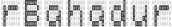

 

<!-- badges: start -->
[](https://cran.r-project.org/package=rBahadur)
[](https://zenodo.org/badge/latestdoi/531716870)

<!-- badges: end -->

> Efficient simulation of genotype / phenotype data under
> assortative mating by generating Bahadur order-2
> multivariate Bernoulli distributed random variates.

## Features

* Multivariate Bernoulli (MVB) distribution samplers
  * `rb_dplr`: generate Bahadur order-2 MVB variates with diagonal-plus-low-rank (DPLR) correlation structures
  * `rb_unstr`: generate Bahadur order-2 MVB variates with arbitrary correlation structures
* Assortative mating  modeling tools
  * Compute equilibrium parameters under univariate AM
    * `h2_eq`: compute equilibrium heritability
    * `rg_eq`: compute equilibrium cross-mate genetic correlation
    * `vg_eq`: compute equilibrium genetic variance
  * Generate genotype / phenotype data given initial conditions
    * `am_simulate`: complete univariate genotype / phenotype simulation
    * `am_covariance_structure`: compute outer-product covariance component for AM-induced DPLR covariance structure


## Installation

`rBahadur` is now on CRAN:

```r
install.packages("rBahadur")
```

Alternatively, you can install directly from github using the `install_github` function provided by the [`remotes` library](https://github.com/r-lib/remotes):

```r
remotes::install_github("rborder/rBahadur")
```

## Usage

Here we demonstrate using `rBahadur` to simulate genotype / phenotype at equilibrium under AM: given the following parameters:

 - `h2_0`: panmictic heritability
 - `r`: cross-mate phenotypic correlation
 - `m`: number of diploid, biallelic causal variants
 - `n`: number of individuals to simulate
 - `min_MAF`: minimum minor allele frequency
 
 ```r
set.seed(2022)
h2_0 = .5; m = 2000; n = 5000; r =.5; min_MAF=.05

## simulate genotype/phenotype data
sim_dat <- am_simulate(h2_0, r, m, n)
```

We compare the target and realized allele frequencies:

```r

## plot empirical first moments of genotypes versus expectations
afs_emp <- colMeans(sim_dat$X)/2
plot(sim_dat$AF, afs_emp)
```

We compare the expected equilibrium heritability to that realized in simulation: 

```r

## empirical h2 vs expected equilibrium h2
(emp_h2 <- var(sim_dat$g)/var(sim_dat$y))
h2_eq(r, .5)
```

## Citation

Developed by [Richard Border](https://www.richardborder.com) and [Osman Malik](https://osmanmalik.github.io/). For further details, or if you find this software useful, please cite:
 - Border, R. and Malik, O.A., 2022. `rBahadur`: efficient simulation of structured high-dimensional genotype data with applications to assortative mating. _BMC Bioinformatics_. https://doi.org/10.1186/s12859-023-05442-6 

## Background reading:

 - The Multivariate Bernoulli distribution and the Bahadur representation:
   - Teugels, J.L., 1990. Some representations of the multivariate Bernoulli and binomial distributions. _Journal of Multivariate Analysis_, 32(2), pp.256-268. https://doi.org/10.1016/0047-259X(90)90084-U
   - Bahadur, R.R., 1959. A representation of the joint distribution of responses to n dichotomous items. _School of Aviation Medicine, Randolph AFB, Texas_. https://apps.dtic.mil/sti/citations/AD0706093
 - Cross-generational dynamics of genetic variants under univariate assortative mating:
    - Nagylaki, T., 1982. Assortative mating for a quantitative character. _Journal of Mathematical Biology_, 16, pp.57–74. https://doi.org/10.1007/BF00275161
